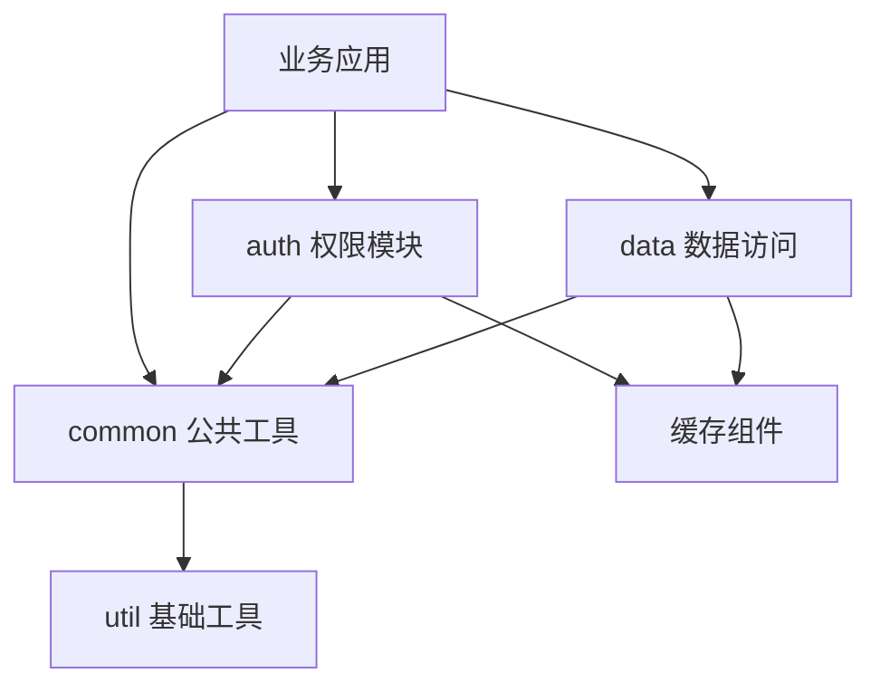
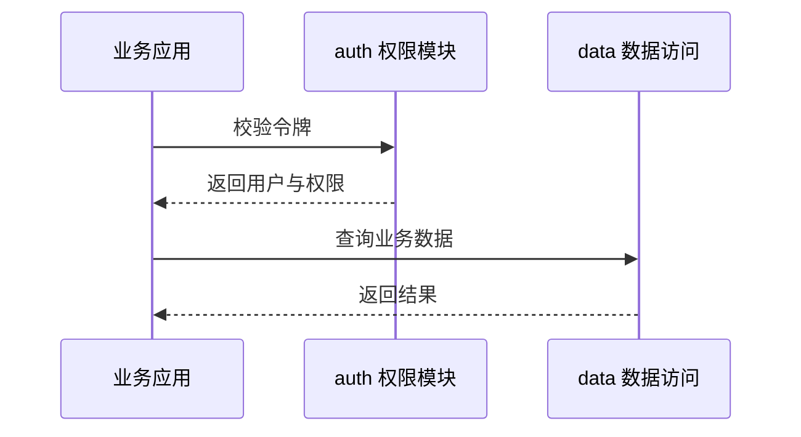

# Mermaid 图表示例

本文档演示文档门户里的 Mermaid 图表怎么用，可以直接照着改。图表在浏览器本地渲染，不依赖外网 CDN。

## 模块依赖图

## 调用时序

## 常用写法

- 流程图用 `graph TD` 或 `flowchart TD`，`TD` 从上到下，`LR` 从左到右。
- 节点文字写在方括号里，例如 `auth[权限模块]`。
- 箭头 `-->` 表示依赖方向。
- 时序图用 `sequenceDiagram`，参与方用 `participant` 声明。
- 代码块语言写 mermaid 就会渲染成图，其他语言仍按代码高亮显示。

## TEST
测试git钩子